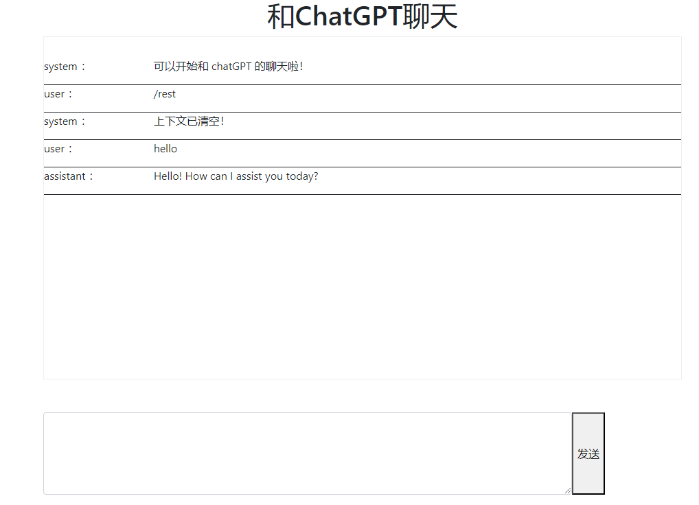

# ChatGPT 聊天demo

## 项目说明
整个项目非常简单，使用 flask 、openai 、jquery 库，通过http 接口方式访问 ChatGPT 。

## 项目特点
支持上下文的聊天。

清空上下文的方法是输入 `/reset`、`clr`、`cls`、`clear` 关键字，

## 项目运行要求
因众所周之的原因，必须配置代理才能使用。

## 添加依赖包

```
pip install -r requirements.txt
```

## 项目配置
在 settings.py 中配置相应的参数

```
OPENAI_API_KEY='sk-xxxxx'
OPENAI_ORGANIZATION='org-yyyyy'

HTTP_PROXY='http://127.0.0.1:端口号'
HTTPS_PROXY='http://127.0.0.1:端口号'
```

## 项目运行
```
python  app.py
```

默认访问路径：  `http://127.0.0.1:5000/`

## 项目截图




